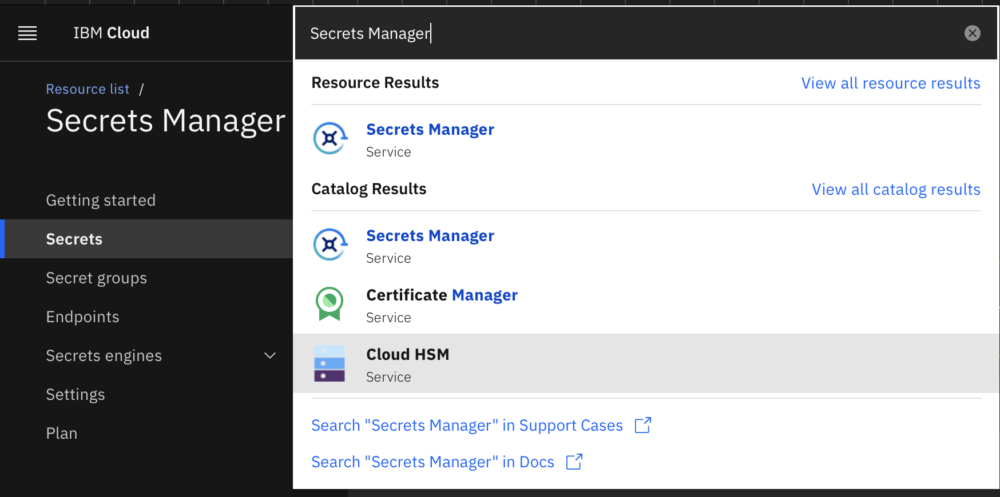

# CP4BA - Oneshot GitOps Install


## Acknowledgements

This project was chiefly inspired off the good work done by the Apollo, GitOps and OTP teams as given below:

1) https://github.com/apollo-business-automation/ibm-cp4ba-enterprise-deployment 
2) https://github.com/one-touch-provisioning/otp-gitops
3) https://production-gitops.dev/ 


## Overview

Deploying CloudPaks into supported clouds in a repetable, automatable fashion is a non trivial, potentially time consuming process. This project aims to lay the foundation for future deployments, culminating in an end state which supports the following capabilities:

1) Ability to select CloudPaks, and which services within said CloudPak to deploy
2) Ability to deploy common, "big win" use cases (applications) using said framework
3) Native integration with a wide range of CI Tooling. Eg, Jenkins.
4) A range of target deployments options given, ranging from all key supported hyperscalers to on-premise deployments
5) Inbuilt monitoring and auditing framework to support day 2 operations 
6) And more

This is still a work in progress, we expect more work to be done here down the road.

## Shoutouts

This base implementation would not have been possible without the following individuals:

1) Leela Chitta
2) Ondrej Svec
3) Dalli Bagdi
4) Tim Quigly
5) Jan Dusek


## Usage

This automation involves, as one would expect, the creation of secrets. Creating plain Kubernetes secrets and storing the corresponding K8's YAMLs as plain text in a Git Repository is ill advised. One way to circumnavigate this is through [SealedSecrets](https://github.com/bitnami-labs/sealed-secrets). That said, using SealedSecrets to handle a large number of secrets can quite get clunky. There is an overhead in relation to a number of steps that must be performed which, from a maintainability perspective, does not scale so well. On the other hand, we may need to integrate with a client secret store - they may prefer to use their own instance of Vault for example. As a result, we have externalised the secrets to an external store. We use the [ExternalSecret operator](https://external-secrets.io/v0.6.0-rc1/) to accomodate for this. As given in the link, the following (amongst others) secret manager instances are supported:

1) AWS Secrets Manager
2) Azure Key Vault
3) Google Secrets Manager
4) HashiCorp Vault

This is great. Customers on AWS, Azure and Google will (most likely) use the corresponding secret providers given above. HashiCorp Vault is fairly popular too. This way, we "meet customers in the middle". 

In this project, we leverage IBM Secrets Manager for [this](https://cloud.ibm.com/docs/secrets-manager?topic=secrets-manager-vault-api), which uses a custom version of open source HashiCorp Vault for this. The secrets we need to create to standup CP4BA with FileNet and IER are the following:

1) A Universal Password
2) An IBM Entitlement Key
3) An LDAP secret (Admin and Config Password) assigned to the root user

We have, for sake of simplicity, created a secret - the Universal Password - and assigned this secret to the various different services constituting this CloudPak, as we shall see in the next section. In a production setting, it is recommended to have a "one to one" mapping betwee secret and corresponding service as opposed to a "many to one" mapping as we have done here.

The upshot of all this is one (as opposed to many) instance of a SealedSecret needs to be created, which is the secret required to access the aforementioned external secret store.


### Secret Creation

As mentioned earlier, we will leverage IBM Secrets Manager for this. Non-privileged accounts do get a thirty day free trial to deploy an instance of Secrets Manager in IBM Cloud. Refer to the image below.



First and foremost, you will need an API Key to access this instance programmatically (this API Key is our SealedSecret).


For more information on how to obtain an API Key, please refer to the following [link](https://cloud.ibm.com/docs/account?topic=account-userapikey&interface=ui). I do encourage you to read the third paragraph found in the link should you wish to deploy this asset in a production setting. In particular: **"it is recommended that you create an API key that is associated with a functional ID that is assigned the minimum level of access that is required to work with the service".** This is a no brainer. Abiding by the principles of least privilege (or common sense), your API Key should only have READ access to said instance, no more and no less.

With that out of the way, we can now go ahead and create the secrets required to standup the CloudPak. Your UI should resemble the following once you are done with the procedure.


Take note of the key names here. It is recommended to leave them as such, otherwise you will have to update the names upstream in the relevant YAML files (which is dealt with in the upcoming section). Please mind the camelCase format should you choose to change the name, do not use snake_case or kebab-cases. These special characters are interpreted and parsed differently and will result in erraneous behaviour. 

Follow the steps given below to create the adminPassword, universalPassword and configPasswords. It is of type string. Feel free to choose any string value you please. It is recommended to choose a random secure password. This [link](https://www.helperset.com/tools/generate-secure-string) generates a random secure string on demand. 15 or so characters should suffice. The default (32) is overkill.

Click "Add", located towards the right of the screen. You will be presented with the following options:


Click "Other Secret Type". You will be given the following:


The name should correspond to the names given earlier. Bear in mind the strict camelCase convention imposed in the event you do choose to use a different name. Populate the secret value with the random secure string mentioned earlier. Take note of the ID associated with this password and store it somewhere for the time being. Refer to the image below in the event you don't have the ID's handy. Simply click the "Details" section and copy the ID presented to you.


Rinse and repeat till the following passwords are created in secrets manager:

1) universalPassword
2) adminPassword
3) configPassword

The IBM Entitlement Key creation is slightly more involved. You will have to obtain the JSON representation of the entitlement key. 

First and foremost, navigate to this [site](https://myibm.ibm.com/products-services/containerlibrary) to obtain your key. Once the key is obtained, run the following bad boy of a command:

```
oc create secret docker-registry ibm-entitlement-key --dry-run=client -o json \
--docker-username=cp \
--docker-password="your_ibm_entitlement_key_here" \
--docker-server=cp.icr.io \
--docker-email=your_email_here@ibm.com | jq '.data.".dockerconfigjson"' |  tr -d '"' | base64 --decode
```

The following assumptions are made:

1) The "oc" binary is installed and present in the path variable
2) The "jq" binary is installed and present in the path variable
3) Unix/Linux workstation. TODO: Find equivalent windows command.

You need not login to an openshift cluster for this thanks to the dry-run parameter present in the command.

Be sure to replace the values associated with the docker-password and docker-emails fields accordingly. Copy the output and follow the same procedure for secret creation as given above for the ibm entitltment key, except this time you will be pasting the output of the command given above as opposed to generating a random secure string. Please make note of the ID here as well.

Your UI should resemble the following now.


Before proceeding with the enxt section, navigate to the "Endpoints" tab as given below, and note down the Public Endpoint (highlighted) below:


Well done! Give yourself a pat in the back before proceeding to the next section. 

### Secret Updates

Within the services repository you cloned, the following files need to be updated:

1) SECRET_PATH/ban.yaml
2) SECRET_PATH/fncm.yaml
3) SECRET_PATH/ibm-entitlement-key.yaml
4) SECRET_PATH/ier.yaml
5) SECRET_PATH/ldap-bind.yaml
6) SECRET_PATH/rr.yaml
7) SECRET_PATH/universal-password.yaml
8) DB2_PATH/create/base/pull-secret.yaml
9) LDAP_PATH/templates/external-admin-secret.yaml

Where:
```
SECRET_PATH=instances/cloudpak/cp4ba/predeploy/secrets
DB2_PATH=instances/db2
LDAP_PATH=instances/openldap
```

Specifically, the files given in list elements 1, 2, 4, 6 and 7 need to have their spec.data.remoteRef.key value updated with the id associated with the universalPassword secret you created in the previous section for the list entry with name universalPassword. If you used a different name, this name field would also need to be updated. Please refer to the image below. I've highlighted the relevant field to update. (Hint: this field is found in line 10 of each file)


Update list elements 3 and 8 with the id associated with the ibmEntitlementKey. If you used a different name, this name field would also need to be updated. (Hint: this field is found in line 10 of each file)

Finally, update list elements 5 and 9 with the LDAP admin and config passwords created in the previous section. It should be fairly straighforward to conclude as to what this procedure entails.

Finally, modify the serviceUrl field in the "cluster-secret-store.yaml" file found in "instances/external-secrets-instance/overlays/default/" directory to coincide with the public endpoint of your secrets manager (vault) instance you noted down in the previous section. Please refer to the image below.


Make sure you commit and push your changes accordingly.

Please do note, we do ultimately want to provide automation around this, when this is consumable via TechZone. For now, bear with us. This is the automation that will happen behind the scenes in any case.

